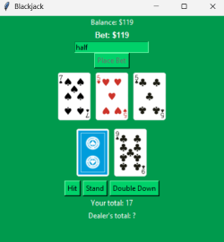

# Blackjack
[This repository](https://github.com/Saier-9/Blackjack) contains simple Blackjack game built using Python and Tkinter. It features betting mechanics, currency, and a graphical representation of cards. The game starts with a balance of $100, and players can place bets, hit, stand, or double down to try and beat the dealer.

## Features
- Playable Blackjack game with betting mechanics
- Graphical user interface using Tkinter
- Card visualization with suits and colors
- Double Down functionality
- Automatic dealer logic
- Balance tracking and win/loss conditions
